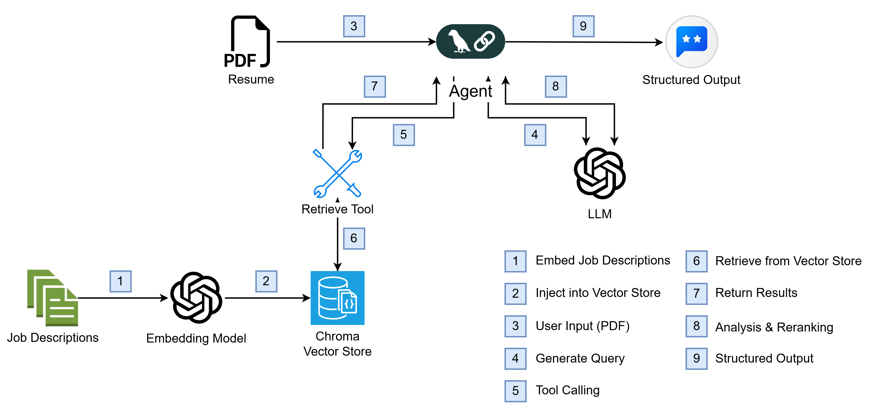

# Agentic Resume Matcher 💼

An AI-powered Career Coach that matches your resume (PDF) with real job postings using autonomous agents.

## Architecture


## Features
- **Agentic Search**: Autonomously formulates queries and searches a vector DB of real jobs.
- **Multimodal**: Accepts PDF resumes directly.
- **Structured Analysis**: Returns a score, reasoning, strengths, and missing skills.
- **Real Data**: Ingests job descriptions from Google Careers.

## Quick Start

### 1. Setup
```bash
# Install dependencies
pip install -r requirements.txt

# Set OpenAI API Key
echo "OPENAI_API_KEY=sk-..." > .env
```

### 2. Ingest Data (Optional)
If running for the first time, scrape and index jobs:
```bash
python src/ingestion.py
```

### 3. Run Servers
**Backend:**
```bash
python main.py
```

**Frontend:**
```bash
streamlit run streamlit_app.py
```
Open [http://localhost:8501](http://localhost:8501) to start matching!

## Tech Stack
- **AI**: LangChain, GPT, OpenAI Embeddings
- **Database**: ChromaDB (Vector Store)
- **Backend**: FastAPI
- **Frontend**: Streamlit
